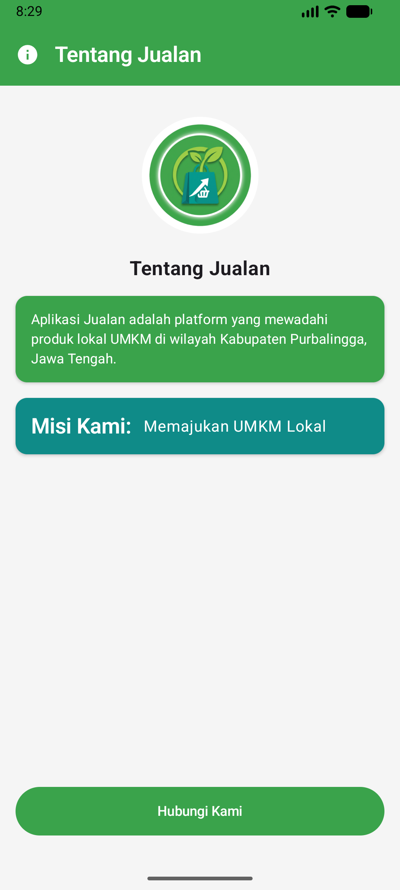
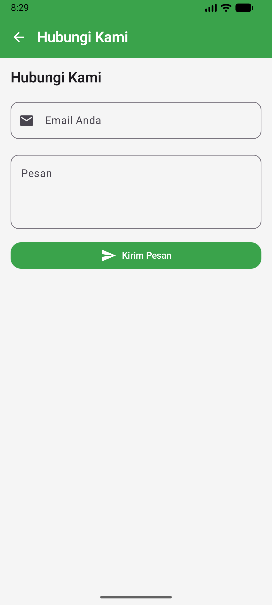

# Praktikum Mobile Kotlin 1 - Aplikasi Jualan

Aplikasi Android berbasis **Jetpack Compose** untuk platform **Jualan**, sebuah wadah yang memfasilitasi produk lokal UMKM di wilayah Kabupaten Purbalingga, Jawa Tengah. Proyek ini mencakup implementasi tata letak deklaratif Compose, sistem navigasi antar-layar (NavHost), komponen Material 3, formulir interaktif, dan kustomisasi tema.

---

## 📱 Tangkapan Layar (Screenshots)

| Layar Tentang Jualan (Basic Info) | Layar Hubungi Kami (Form Kontak) |
| :---: | :---: |
|  |  |

---

## ✨ Fitur Aplikasi

1. **Layar Informasi (Basic Info Screen)**
   - TopAppBar dengan judul dan ikon informasi.
   - Tampilan logo aplikasi berbentuk melingkar (*circular clip*).
   - Kartu informasi deskripsi platform UMKM lokal Purbalingga.
   - Kartu misi: *Memajukan UMKM Lokal*.
   - Tombol navigasi untuk berpindah ke layar *Hubungi Kami*.

2. **Layar Formulir Kontak (Hubungi Kami Screen)**
   - TopAppBar dengan tombol navigasi kembali (*Back Navigation*).
   - Kolom isian *Email* dengan ikon email.
   - Kolom isian *Pesan* multiline.
   - Tombol kirim pesan dengan ikon *Send*.
   - Notifikasi interaktif *Snackbar* (*"Pesan Terkirim"*).

3. **Tema dan Tipografi (Theme & Typography)**
   - Skema warna kustom (Primary, Secondary, Tertiary/PrimaryVariant, Background, Surface).
   - Tipografi Material 3 yang disesuaikan (*headlineMedium*, *titleLarge*, *bodyLarge*, *bodyMedium*, *labelLarge*).

---

## 🛠️ Teknologi & Dependensi

- **Bahasa**: [Kotlin](https://kotlinlang.org/)
- **UI Toolkit**: [Jetpack Compose](https://developer.android.com/jetpack/compose) (Material 3)
- **Navigasi**: [Jetpack Navigation Compose](https://developer.android.com/jetpack/compose/navigation)
- **Min SDK**: API 24 (Android 7.0)
- **Target SDK**: API 35 (Android 15)

---

## 🚀 Cara Menjalankan

1. Clone repositori ini:
   ```bash
   git clone https://github.com/yaakfi/H1D024114-praktikum-mobile-kotlin.git
   ```
2. Buka folder proyek di **Android Studio**.
3. Sinkronkan Gradle (*Sync Project with Gradle Files*).
4. Pilih emulator Android atau perangkat fisik yang terhubung (USB debugging aktif).
5. Klik **Run** (`Shift + F10`) atau jalankan perintah Gradle:
   ```bash
   ./gradlew installDebug
   ```
